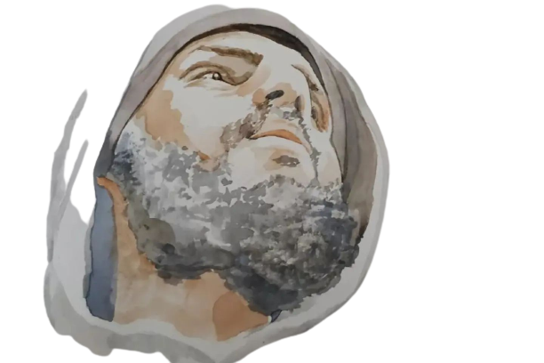
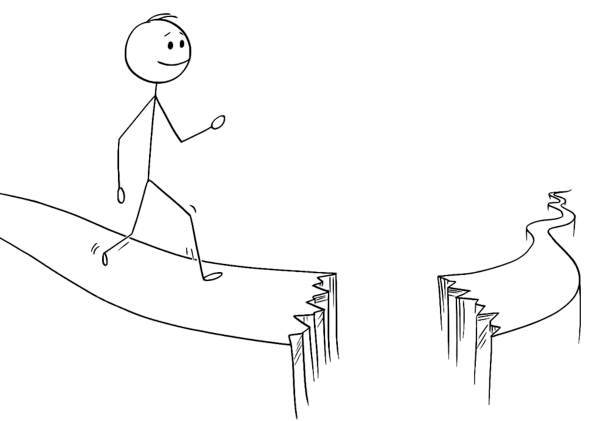

# Welcome
{: .fs-9 }

__*I plan to create awesomeness. I don't know where I'm heading, but I'm thrilled. I'm a bit exhausted.*__

[Wiki @ Study](https://r8w.github.io/notes){: .btn .mr-2 } [Wiki @ Personal](https://r8w.github.io/personal){: .btn .btn .mr-2 }

---

---

<!-- - *Credit for the artwork goes to [Aude](https://www.instagram.com/aude_boulord/) who is a dear friend, a phenomenal human being, and a dexterous artist.*
{: .fs-1 .fw-500} -->

<!-- 

*This picture was taken by my friend in 2015.* -->

<!-- {: .fs-4 .text-center .fw-500 } -->

## Introduction

Hi, I’m Rishi, and this is my wiki. I go by basically two names on the internet - __[`@CodeDotJS`](https://github.com/CodeDotJS)__, and this year I added __[`@r8x`](https://ir8x.me)__ to the list. Anyways, I think the names are not that consequential, *especially* in my case.

I'm a decent human being. I tend to believe I've got a good heart, but I often come across as someone who doesn't care about things, which is partially true. I detest diplomacy, despise gossip, and dislike anything that's unnecessarily complicated. No, I'm *not* a boring person. I've got jokes to share, puns to make, projects to finish, people to take care of, and *__miles to go before I sleep.__*

In recent years, I’ve developed a lot of hobbies, and I wish to be the jack of all trades and master of none. I believe hobbies should bring you nothing but pleasure, and that’s why I hold an unpopular opinion that one should not take their hobbies seriously. Try things, move on, and you will be back to it.

I also call myself a __*0.1x Programmer*__ or a __*0.1x Chef*__. I indeed find peace when I cook, and I do love programming. In both cases, I'm, after all, making something. I don't use any other labels to describe myself, and I'm not a big fan of labels.

For me, life is all about doing things that matter despite getting pulled back by the circumstances. I'm all the choices I've made, so regret is not an option. The goal is to move slowly; break things, and fix them along the way. Life's a journey, and I wish to capture the moments through my eyes and preserve the gist of infinity through markdown. The road is never ending, unpredictable, and full of chaos. I'll take a walk to confirm it.

---

## Reason @ Wiki

The reason for building this wiki is simple - I wanted to have a place where I consciously dump anything and everything. Bookmarking works, but as far as I remember, it never worked for me.

Later, when I started taking notes and building the habit of writing most of what was going on in my mind, I realized I needed a place to organize my thoughts and words. I'm someone who has already been into this sea of note-taking applications, and I could not dare to dive again, so I decided to give up on various tools and stick to something handy and easy to maintain -- *this wiki*.

> *“There is no greater agony than bearing an untold story inside you.”*
	__― *Maya Angelou*__

My life's been a hell of a ride. When I say hell, I mean it. I'm not saying I understand life, but I've observed it closely. It overwhelms and disappoints me at the same time. I've got hundreds of unpublished drafts, and every time I stumble upon the folder they're in, it reminds me of how much has happened in a fraction of my awareness.

I've realized that this wiki is a place where I can exist without any filters, and it's one of the reasons I've decided to transfer my archive to a public place that no one knows. Not yet, at least. I do not plan to disclose my wiki. If you're a stranger reading this -- there's nothing you'll find worth your time, but feel free to explore.

---

## Structure

Somehow this wiki got divided into three parts, and I don't mind. I'll describe the use of each section so that even I don't forget what the absolute hell is going on.

---

### This Wiki

It  deals with the specifics, and the horizon is delimited. Everything is topic based, which makes me stick to the meticulous learning of a particular case or subject.

To deal with the distraction that comes along when I'm studying, I decided to shape this wiki accordingly so that I can only focus on what I'm exploring at that particular time. There are some changes that I need to make, but it's an ongoing process, and I wonder if it will ever stop. I'm not worried about it. Although, worry is a decisive choice of word. I'm optimistic regarding how I've set this wiki up.

It's a place solely for links and some short notes (a better bookmarking system). I'll push most of the descriptive notes on the [notes @ wiki](https://r8w.github.io/notes), which is a child of this wiki.

---

### >> Study Wiki  ---  Learning Curve

Described on the homepage of [note @ wiki](https://r8w.github.io/notes)

### >> Personal Wiki  ---  Life's Slope

Described on the homepage of [life @ wiki](https://r8w.github.io/personal)

---

## Wind-up

*Hopefully, this place will continue to exist for a long time!*
{: .text-center}

